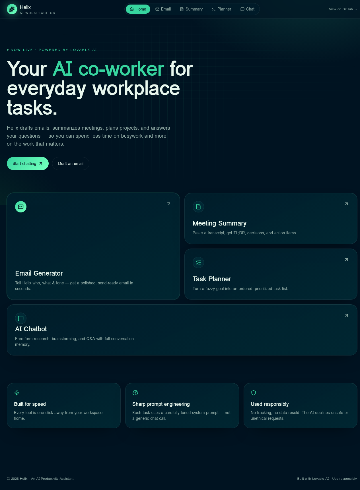
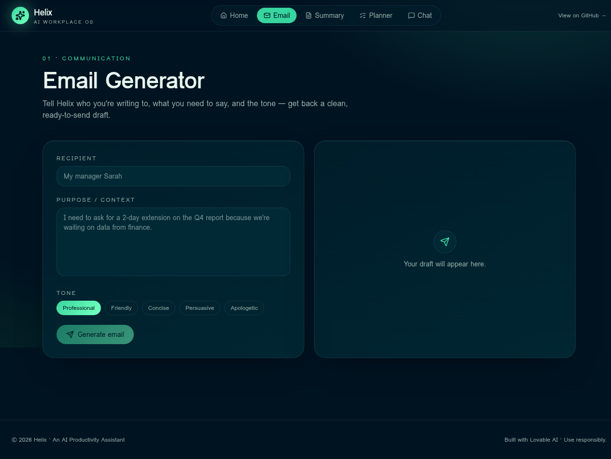
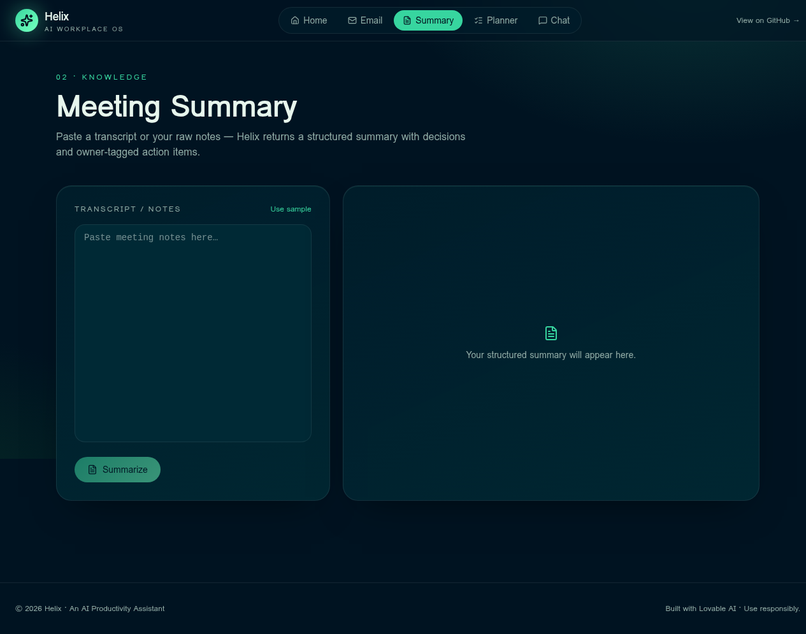
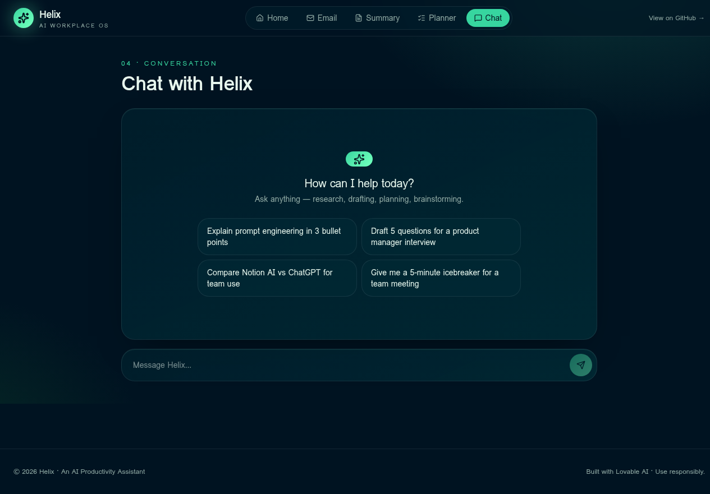
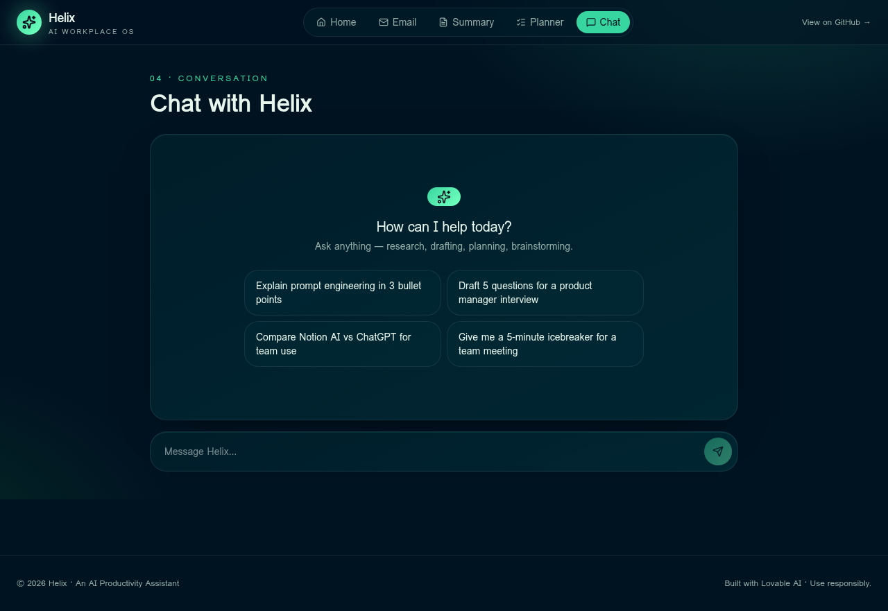

# Helix · AI Workplace OS

> An AI-powered productivity assistant that streamlines email writing, meeting summaries, task planning, and general workplace chat. Built as part of an AI Productivity Assistant coursework project.

**Live Demo:** [https://otter-mind-assist.lovable.app](https://otter-mind-assist.lovable.app)

---

## Demo Screenshots

### Landing Page


### Email Generator


### Meeting Summary


### Task Planner


### AI Chat


---

## Features

| Tool | What it does |
|------|-------------|
| **Email Generator** | Writes polished, ready-to-send emails based on recipient, purpose, and tone (Professional, Friendly, Concise, Persuasive, Apologetic). |
| **Meeting Summary** | Transforms raw transcripts or notes into structured summaries with TL;DR, Key Decisions, Owner-tagged Action Items, and Open Questions. |
| **Task Planner** | Breaks any goal into a concrete, prioritized task list with effort estimates and a clear suggested next step. |
| **AI Chat** | Conversational assistant for general productivity questions, brainstorming, research help, and workplace advice. |

---

## Tech Stack

| Layer | Technology |
|-------|------------|
| **Framework** | [TanStack Start](https://tanstack.com/start) v1 (React 19 + Vite 7) |
| **Styling** | Tailwind CSS v4 with custom Neon Mint design tokens in `oklch` |
| **Fonts** | Space Grotesk (display) + DM Sans (body) |
| **UI Components** | shadcn/ui primitives + custom components |
| **AI Backend** | Lovable AI Gateway (`google/gemini-3-flash-preview`) via server-side `createServerFn` |
| **Authentication** | Lovable Cloud (Supabase Auth) |
| **Deployment** | Lovable / Cloudflare Workers |

---

## Prompt Engineering Approach

Each AI tool uses a carefully crafted **system prompt** and **Zod-validated inputs** to produce high-quality, consistent outputs:

### 1. Email Generator
- **System prompt**: instructs the model to act as an expert workplace communicator, outputting only the email (Subject line first, then body). No markdown headings, no preamble.
- **User prompt**: structures recipient, tone, and purpose into a clean template.

### 2. Meeting Summary
- **System prompt**: enforces exactly four Markdown sections (`## TL;DR`, `## Key Decisions`, `## Action Items`, `## Open Questions`).
- Action items are formatted with **owner tags** and **due dates** for immediate usability.

### 3. Task Planner
- **System prompt**: frames the model as a senior project planner.
- Each task includes a **Title**, **Description**, **Estimated effort** (e.g., 30m, 2h, 1d), and **Priority** (High/Med/Low).
- Ends with a `## Suggested next step` section to drive immediate action.

### 4. AI Chat
- **System prompt**: defines the assistant as "Helix, a friendly and capable AI productivity assistant."
- Instructs concise, structured Markdown responses and includes a **safety guardrail** to decline unsafe or unethical requests.

### Input Validation
All inputs are validated with **Zod** schemas before reaching the AI:
- String length limits (e.g., transcript max 50,000 chars, email purpose max 2,000 chars)
- Enum constraints on tone values
- Min/max bounds on chat message history (1–40 messages)

---

## How to Run Locally

```bash
# 1. Clone the repository
git clone <your-repo-url>
cd <repo-name>

# 2. Install dependencies
bun install

# 3. Set up environment variables
# Copy .env and ensure LOVABLE_API_KEY is configured (server-side only)

# 4. Start the development server
bun dev
```

The app will be available at `http://localhost:3000`.

---

## Project Structure

```
.
├── docs/screenshots/          # Demo screenshots for README
├── src/
│   ├── components/
│   │   ├── app-shell.tsx      # Shared layout (header, nav, footer)
│   │   ├── tool-page.tsx      # Reusable tool layout wrapper
│   │   └── ui/                # shadcn/ui primitives
│   ├── integrations/
│   │   └── supabase/          # Supabase client, auth middleware, types
│   ├── lib/
│   │   ├── ai.functions.ts    # Server functions (email, summary, planner, chat)
│   │   ├── error-capture.ts
│   │   └── utils.ts
│   ├── routes/
│   │   ├── __root.tsx         # Root layout with meta tags
│   │   ├── index.tsx          # Landing page (bento grid)
│   │   ├── email.tsx          # Email generator
│   │   ├── summary.tsx        # Meeting summary
│   │   ├── planner.tsx        # Task planner
│   │   └── chat.tsx           # AI chat
│   ├── styles.css             # Design tokens, Neon Mint palette, utilities
│   ├── router.tsx             # TanStack Router setup
│   └── main.tsx               # Entry point
├── package.json
├── tsconfig.json
├── vite.config.ts
└── README.md
```


## Responsible & Ethical Use

This project was built with the following responsible AI principles:

- **No API key in client code**: The AI gateway key is server-side only. Users cannot extract or misuse it.
- **Input validation**: All user inputs are length-limited and type-checked to prevent abuse.
- **Safety guardrails**: The chatbot is instructed to politely decline unsafe, unethical, or harmful requests.
- **Data minimization**: No user data is stored persistently (no database tables required for core functionality). Transcripts, emails, and chat history exist only in the current session.
- **Transparency**: Users always know when content is AI-generated. Outputs are clearly labeled as such.

---

## Key Expectations Met

- ✅ **Applied AI tools effectively**: Used Lovable AI Gateway with a production-grade model (`google/gemini-3-flash-preview`) for real-time generation.
- ✅ **Prompt engineering skills**: Each feature has a hand-tuned system prompt with role definition, output format constraints, and guardrails.
- ✅ **Functional & practical solution**: Four working tools that solve real workplace productivity problems.
- ✅ **Responsible & ethical use**: Safety guardrails, input validation, no client-side API exposure, data minimization.

---

## License

MIT · Built with [Lovable AI](https://lovable.dev) for educational purposes.
